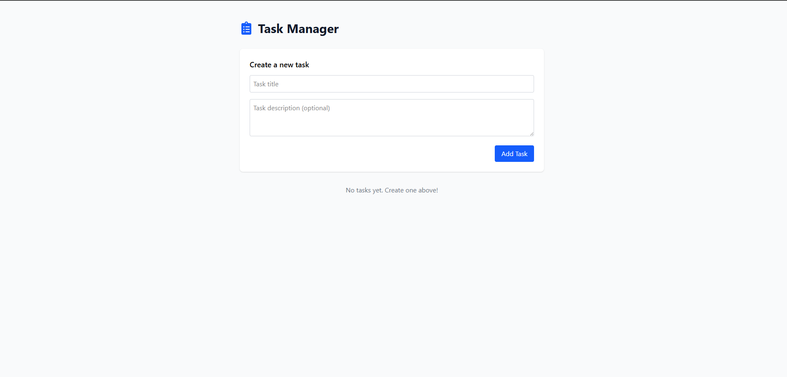

# Intern Task

This project consists of a **client** (React with Vite) and a **server** (Node.js with Express and MongoDB) for task management.

## Installation and Setup

### Prerequisites
- Node.js (>=16.x)
- MongoDB (local or cloud instance)
- Git

### Steps to Run

#### 1. Clone the Repository
```sh
git clone https://github.com/your-repo/ayushiiitu-intern-task-3.git .
```

#### 2. Set Up the Server
```sh
cd server
cp .env.sample .env  # Update environment variables accordingly
npm install
npm start
```

#### 3. Set Up the Client
```sh
cd ../client
npm install
npm run dev
```

## API Documentation

Full API documentation is available on Postman:

[](https://documenter.getpostman.com/view/32615809/2sAYkKJdFJ)

## Testing the API Using Postman
1. Open Postman and import the API collection from the link above.
2. Select the appropriate request (GET, POST, PUT, DELETE).
3. Provide necessary request bodies and parameters.
4. Click "Send" to execute the request and view the response.

## UI Screenshots


---


